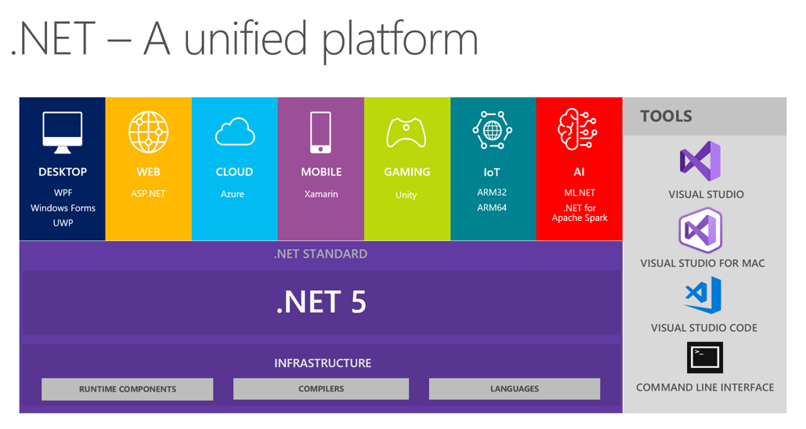
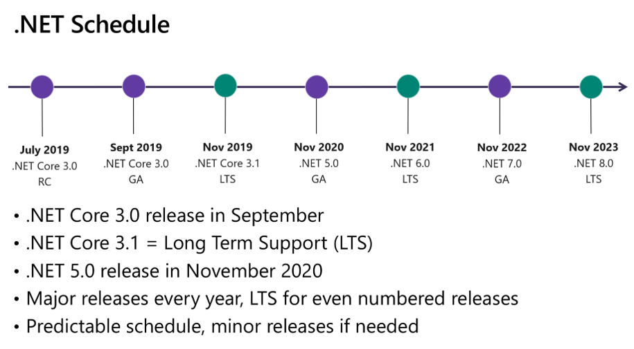

# .NET Core

-  -  -  -  -

# .NET Core 特性
- **跨平臺**： 可在 Windows、macOS 及 Linux作業系統上執行。
- **在各架構間皆保持一致**： 在多個架構上 (包括 x64、x86 及 ARM) 可使用相同的行為執行程式碼。
- **命令列工具**： 包含易用的命令列工具，可用於本機開發及持續整合案例。
- **彈性的部署**： 可以包含在您的應用程式中，或並存安裝（全使用者或全系統安裝）。 可搭配 Docker 容器使用。
- **相容**： .NET Core 可透過 .NET Standard 與 .NET Framework、Xamarin 和 Mono 相容。
- **開放原始碼**︰.NET Core 平台是開放原始碼，使用 MIT 和 Apache 2 授權。.NET Core 是 .NET Foundation 專案。
- **受 Microsoft 支援**

-  -  -  -  -

# .NET Core的未來（一）

-  -  -  -  -

# .NET Core的未來（二）
