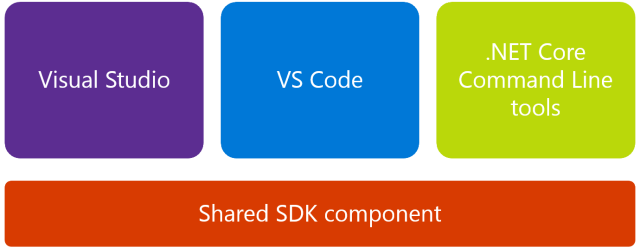

# .NET Core CLI

-  -  -  -  -

# .NET Core CLI
- .NET Core 命令列介面 (CLI) 是新的跨平台工具鏈，適用於開發 .NET 應用程式。 CLI 是整合式開發環境 (IDE)、編輯器等高層級工具所依靠的基礎。
- CLI 工具針對所有能開發 .NET Core應用程式的平台都提供了安裝包，例如Linux的RPM、DEB包或Windwos的MSI包。
- CLI 會以並存的形式安裝，因此一部電腦上可以同時存在多個版本的 CLI 工具（預設使用最新版本）。

-  -  -  -  -

# .NET Core 驅動程式
- .NET Core CLI實際上是用於執行dotnet.exe驅動程式的命令。
- 驅動程式的名稱是 dotnet，且有兩個責任：
  1. 執行相依於架構的應用程式
  2. 執行命令
- 驅動程式執行時，會決定要使用的 SDK 版本。 若沒有 'global.json'，將會使用最新可用版本的 SDK。 

-  -  -  -  -

# .NET Core 驅動程式
- 當您提供命令給驅動器時，dotnet.exe 會啟動 CLI 命令執行程序。 例如：
```
dotnet build
```
- 命令行的格式如下：
```
dotnet <command> <arguments> <common-options>
```
- CLI 採用擴充性模型，可讓您為專案指定額外工具，命令行的格式如下：
```
dotnet <host-options> <command> <arguments> <common-options>
```

-  -  -  -  -

# .NET Core 驅動程式
- **命令(command)**：
此命令會執行動作。 例如，`dotnet build` 會建置程式碼。 `dotnet publish` 會發佈程式碼。
- **引數(arguments)**：
您在命令列上傳遞的引數即為叫用命令的引數。 例如當您執行 `dotnet publish my_app.csproj` 時，my_app.csproj 引數表示要發佈的專案，並且會傳遞給 publish 命令。
- **選項(common-options)**：
您在命令列上傳遞的選項即為叫用命令的選項。 例如當您執行 `dotnet publish --output /build_output`，--output 選項及其值會傳遞給 publish 命令。

-  -  -  -  -

# .NET Core 驅動程式命令
<escape>
    <table class="tableizer-table">
      <thead>
        <tr class="tableizer-firstrow">
          <th colspan="2">基本命令</th>
          <th>專案修改命令</th>
          <th>進階命令</th>
        </tr>
      </thead>
      <tbody>
        <tr>
          <td>new</td>
          <td>pack</td>
          <td>add package</td>
          <td>nuget delete</td>
        </tr>
        <tr>
          <td>restore</td>
          <td>migrate</td>
          <td>add reference</td>
          <td>nuget locals</td>
        </tr>
        <tr>
          <td>build</td>
          <td>clean</td>
          <td>remove package</td>
          <td>nuget push</td>
        </tr>
        <tr>
          <td>publish</td>
          <td>sln</td>
          <td>remove reference</td>
          <td>msbuild</td>
        </tr>
        <tr>
          <td>run</td>
          <td>help</td>
          <td>list reference</td>
          <td>dotnet install script</td>
        </tr>
        <tr>
          <td>test</td>
          <td>store</td>
          <td></td>
          <td></td>
        </tr>
        <tr>
          <td>vstest</td>
          <td></td>
          <td></td>
          <td></td>
        </tr>
      </tbody>
    </table><!-- .element style="font-size: 0.5em;" -->
</escape>

- 參考連結
  1. [.NET Core 命令列介面 (CLI) 工具](https://docs.microsoft.com/zh-tw/dotnet/core/tools/?WT.mc_id=DT-MVP-5003022&ranMID=24542&ranEAID=je6NUbpObpQ&ranSiteID=je6NUbpObpQ-RGbAK6ar2A3aOqZTNRYdCQ&epi=je6NUbpObpQ-RGbAK6ar2A3aOqZTNRYdCQ&irgwc=1&OCID=AID2000142_aff_7593_1243925&tduid=(ir__0gdzqkspo9kftmgykk0sohzx0v2xgdk3eh620jjm00)(7593)(1243925)(je6NUbpObpQ-RGbAK6ar2A3aOqZTNRYdCQ)()&irclickid=_0gdzqkspo9kftmgykk0sohzx0v2xgdk3eh620jjm00&tabs=netcore2x)
  2. [.NET Core CLI Cheat Sheet by oba](https://www.cheatography.com/oba/cheat-sheets/dotnet-cli/)


-  -  -  -  -

# .NET Core 工具分層（一）

- 新版的.NET Core中CLI不再是基本層，而由共享SDK組件(Shared SDK Component)取代。
- Shared SDK Component是一組目標和相關聯的工作，負責編譯程式碼、發佈、封裝 NuGet 套件等等。

-  -  -  -  -

# .NET Core 工具分層（二）
- 所有工具集都使用共享SDK組件及其目標(包括CLI)，例如我們在使用 `dotnet publish` 指令時，其實是由共享SDK組件去調用MSBuild目標，因此下面兩個指令意義是等同的：
  - 使用dotnet publish
```
dotnet publish -o pub -c Release
```
  - 使用dotnet msbuild
```
dotnet msbuild -t:Publish -p:OutputPath=pub -p:Configuration=Release
```
