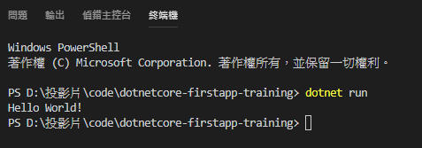

# 開始第一隻 .NET Core程式

-  -  -  -  -

# 建立第一支 .NET Core程式

- 開啟命令提示字元，並建立名為 dotnetcore_firstapp_training 的資料夾。 巡覽至您已建立的資料夾，並鍵入下列內容：

```
dotnet new console
```

- `dotnet new`會以建立主控台應用程式所需的相依性，建立最新的.csproj專案檔案。 它也會建立一個Program.cs，這是一個基本檔案，其中包含應用程式的進入點。

-  -  -  -  -

# csproj專案檔

- 專案檔會指定還原相依性和建置程式所需的所有內容。
  1. <OutputType> 元素指定我們要建立可執行檔，也就是主控台應用程式。
  2. <TargetFramework> 元素會指定我們的目標 .NET 實作為目標。 在進階案例中，您可以指定多個目標架構，並在單一作業中建置這全部的架構。 在本教學課程中，我們將只針對 .NET Core 3.1 進行建立。

```xml
<Project Sdk="Microsoft.NET.Sdk">
  <PropertyGroup>
    <OutputType>Exe</OutputType>
    <TargetFramework>netcoreapp3.1</TargetFramework>
    <RootNamespace>dotnetcore_firstapp_training</RootNamespace>
  </PropertyGroup>
</Project>
```

-  -  -  -  -

# Program.cs

- Program類別中Main方法的內容則是Coding的起手式—印出Hello World!。

```csharp
using System;

namespace dotnetcore_firstapp_training
{
    class Program
    {
        static void Main(string[] args)
        {
            Console.WriteLine("Hello World!");
        }
    }
}
```

-  -  -  -  -

# 執行程式（一）

- 最後鍵入下面的內容來執行程式：

```
dotnet run
```

- dotnet run會呼叫dotnet 組建，以確保組建目標已建立，然後呼叫 dotnet <assembly.dll> 以執行目標應用程式。

- 如下圖，執行後會印出Hello World!字樣。


-  -  -  -  -

# 執行程式（二）

- 或者，也可以執行 `dotnet build` 來編譯器代碼。這會根據專案的名稱，以 DLL 檔案的形式產生已編譯的應用程式。 在此情況下，所建立的檔案會命名為dotnetcore-firstapp-training.dll。

- 可以在 Windows 上使用 `dotnet bin\Debug\netcoreapp3.1\dotnetcore-firstapp-training.dll` 執行（非 Windows 系統時使用 /，之後不再贅述）。

- 當編譯應用程式時，會與 dotnetcore-firstapp-training.dll 一併建立作業系統特定的可執行檔。在Windows上，應為dotnetcore-firstapp-training.exe; 在Linux或macOS上，為dotnetcore-firstapp-training。

-  -  -  -  -

# 發行程式

- 鍵入已下內容以發行程式
```
dotnet publish
```
- 發行後會產生 bin\debug\netcoreapp 3.1 的 publish 資料夾。 
- publish 資料夾的內容可以散發到其他平台，只要那些平台已安裝 .NET Core Runtime。

- 一樣可以利用dotnet指令來執行程式，如 `dotnet bin\Debug\netcoreapp3.1\publish\dotnetcore-firstapp-training.dll` 執行