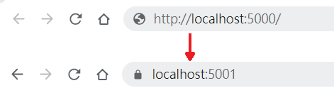

# 將.NET Core Console專案轉為ASP.NET Core專案

-  -  -  -  -

 <!-- .element height="400px" -->
- 在 .NET Core 中，無論是主控台應用程式、 ASP.NET Core 應用程式或是 .NET Core 3.0 才導入的WinForm和WPF程式的進入點都是Program類別的Main方法。

-  -  -  -  -

- 為了能夠更加理解什麼是ASP.NET Core，我們先來把剛剛建立的Console程式，轉換為ASP.NET Core程式...


-  -  -  -  -

# 修改.csproj
- 將.csproj中的 `Microsoft.NET.Sdk` 改為 `Microsoft.NET.Sdk.Web` 。
```xml
<Project Sdk="Microsoft.NET.Sdk.Web">
  <PropertyGroup>
    <OutputType>Exe</OutputType>
    <TargetFramework>netcoreapp3.1</TargetFramework>
    <RootNamespace>dotnetcore_firstapp_training</RootNamespace>
  </PropertyGroup>
</Project>
```

-  -  -  -  -

# 修改Program.cs
- 將Program修改為連到網站，會回應Hello World!字樣。

```csharp
using System;
using Microsoft.AspNetCore.Builder;
using Microsoft.AspNetCore.Hosting;
using Microsoft.AspNetCore.Http;
using Microsoft.Extensions.DependencyInjection;
using Microsoft.Extensions.Hosting;

namespace dotnetcore_firstapp_training
{
    public class Program
    {
        public static void Main(string[] args)
        {
            CreateHostBuilder(args).Build().Run();
        }

        public static IHostBuilder CreateHostBuilder(string[] args) =>
            Host.CreateDefaultBuilder(args)
                .ConfigureWebHostDefaults(webBuilder =>
                {
                    webBuilder.Configure(app => app.Run(context => context.Response.WriteAsync("Hello World!")));
                });
    }
}
```

-  -  -  -  -

# 試試Web版的Hello World程式

- 下指令 `dotnet run` 執行應用程式。
- 未特別設定時，預設網址是http://localhost:5000/ 和 https://localhost:5001/ ，連結到這兩個網址看看是否成功。


-  -  -  -  -

# 新增Startup.cs檔案（一）

- 在ASP.NET Core中，我們一般會把一些服務的注冊和要求處理管線的程式寫在Startup.cs。
- 現在先新增Startup.cs檔案在根目錄，並把剛剛回應Hello World!的程式碼移植到這個cs檔裡面。

-  -  -  -  -

# 新增Startup.cs檔案（二）

- Startup.cs

```csharp
using System;
using System.Collections.Generic;
using System.Linq;
using System.Threading.Tasks;
using Microsoft.AspNetCore.Builder;
using Microsoft.AspNetCore.Hosting;
using Microsoft.AspNetCore.Http;
using Microsoft.Extensions.DependencyInjection;
using Microsoft.Extensions.Hosting;

namespace dotnetcore_firstapp_training
{
    public class Startup
    {
        public void ConfigureServices(IServiceCollection services)
        {
        }

        public void Configure(IApplicationBuilder app, IWebHostEnvironment env)
        {
            app.Run(context => context.Response.WriteAsync("Hello World!"));
        }
    }
}
```

-  -  -  -  -

# 新增Startup.cs檔案（三）

- 修改Program中CreateHostBuilder方法，改為使用Startup

```csharp
        public static IHostBuilder CreateHostBuilder(string[] args) =>
            Host.CreateDefaultBuilder(args)
                .ConfigureWebHostDefaults(webBuilder =>
                {
                    webBuilder.UseStartup<Startup>();
                });
```

-  -  -  -  -

# 使用Routing和Endpoints Middleware

- 剛剛的寫法只要網址是在 http://localhost:5000 下，不管是 http://localhost:5000 或  http://localhost:5000/123 又或是 http://localhost:5000/123/abcd ，都會回傳Hello World!字樣，現在我們希望能夠改為：
  1. 當瀏覽 http://localhost:5000 時回傳Hello World!字樣。
  2. 瀏覽 http://localhost:5000 下的其他網址回傳404。

- 修改Startup的Configure方法

``` csharp
        public void Configure(IApplicationBuilder app, IWebHostEnvironment env)
        {
            app.UseRouting();
            app.UseEndpoints(endpoints =>
            {
                endpoints.MapGet("/", async context =>
                {
                    await context.Response.WriteAsync("Hello World!");
                });
            });
        }
```

-  -  -  -  -

# 為Web增加配置文件（一）

- ASP.NET Core的組態已經不使用XML結構的web.config，改為由更多元的方式取得組態，其中預設的檔案組態改為使用Json。

- 在根目錄增加 `appsettings.Development.json` 和 `appsettings.json` 兩個檔案：

  - appsettings.Development.json
  
  ```json
{
  "Message":"Development"
}
  ```
  - appsettings.json

  ```json
{
  "Message":"Not Development"
}
  ```

-  -  -  -  -

# 為Web增加配置文件（二）
- 為Startup增加引用

```csharp
using Microsoft.Extensions.Configuration;
```
- 預設會直接注冊IConfiguration服務，因此直接在Configure方法增加IConfiguration型別的參數，讓服務能夠注入此方法。

- 在Hello World!後面增加由config取得的Message字串。

```csharp
        public void Configure(IApplicationBuilder app, IWebHostEnvironment env, IConfiguration config)
        {
            app.UseRouting();
            app.UseEndpoints(endpoints =>
            {
                endpoints.MapGet("/", async context =>
                {
                    await context.Response.WriteAsync("Hello World!" +config.GetValue<string>("Message"));
                });
            });
        }
```

-  -  -  -  -

# 為Web增加配置文件（三）

- appsettings文件是以ASPNETCORE_ENVIRONMENT環境變數來判斷，因此我們執行下面兩個指令來比較看看差異。

```command
set ASPNETCORE_ENVIRONMENT=Development
dotnet run
```

```command
set ASPNETCORE_ENVIRONMENT=Production
dotnet run
```

-  -  -  -  -

# 錯誤處理（一）

- 在開發環境時，如果應用程式發生例外狀況時，我們會希望能夠有詳細的錯誤訊息，讓開發人員能夠快速的問題排除。
- 在生產環境時，則會隱藏這些敏感資訊，導到我們自訂的錯誤頁面。

-  -  -  -  -

# 錯誤處理（二）

- ASP.NET Core提供了一個全新的開發人員例外狀況頁面（程式碼、Stack、Query、Cookies、Headers、Routing），透過調用IApplicationBuilder的擴充方法 UseDeveloperExceptionPage，可以讓我們導到該頁面。

 <!-- .element height="350px" -->

-  -  -  -  -

# 錯誤處理（三）

- 為了方便後面測試功能，先修改這段程式碼為：
1. 在網址為 `/ThrowException/` 時，回傳一個InvalidOperationException的例外。
2. 在網址為 `/Error/` 時，回傳一個只有Error字樣的頁面，用作模擬生產環境的自訂錯誤頁面。

```csharp
            app.UseEndpoints(endpoints =>
            {
                endpoints.MapGet("/ThrowException/", async context =>
                {
                    await Task.FromException(new InvalidOperationException("無效的操作"));
                });
                endpoints.MapGet("/Error/", async context =>
                {
                    await context.Response.WriteAsync("Error");
                });
                endpoints.MapGet("/", async context =>
                {
                    await context.Response.WriteAsync("Hello World!"+ config.GetValue<string>("Message"));
                });
            });

```

-  -  -  -  -

# 錯誤處理（四）

- 利用IWebHostEnvironment可以判斷當前的環境。
- 當使用者在開發環境時，讓使用者導向開發人員例外狀況頁面；如不是在開發環境，則導向自訂的錯誤頁面。

```csharp
        public void Configure(IApplicationBuilder app, IWebHostEnvironment env, IConfiguration config)
        {
            if (env.IsDevelopment())
            {
                app.UseDeveloperExceptionPage();
            }
            else
            {
                app.UseExceptionHandler("/Error");
            } 
            app.UseRouting();
            app.UseEndpoints(endpoints =>
            {
                endpoints.MapGet("/ThrowException/", async context =>
                {
                    await Task.FromException(new InvalidOperationException("無效的操作"));
                });
                endpoints.MapGet("/Error/", async context =>
                {
                    await context.Response.WriteAsync("Error");
                });
                endpoints.MapGet("/", async context =>
                {
                    await context.Response.WriteAsync("Hello World!"+ config.GetValue<string>("Message"));
                });
            });
        }
```

-  -  -  -  -

# 錯誤處理（五）

# 為Web增加配置文件（三）

- IWebHostEnvironment是以ASPNETCORE_ENVIRONMENT環境變數來判斷所屬環境，因此我們執行下面兩個指令來比較看看差異，並於網址列輸入 http://localhost:5000/ThrowException/ 測試。

```command
set ASPNETCORE_ENVIRONMENT=Development
dotnet run
```

```command
set ASPNETCORE_ENVIRONMENT=Production
dotnet run
```

-  -  -  -  -

# 靜態檔案（一）

- HTML、CSS、影像和 JavaScript 這類靜態檔案都是 ASP.NET Core 應用程式直接提供給用戶端的資產。在ASP.NET Core中，需要經過一些設定才能提供這些檔案。

- 靜態檔案會儲存在專案的 web 根目錄中。 預設目錄是 {content root}/wwwroot，但可以透過UseWebRoot方法加以變更。 

> - 內容根目錄的基底路徑，通常包含：
>   - 裝載應用程式的可執行檔（.exe）。
>   - 組成應用程式的已編譯元件（ .dll）。
>   - 應用程式所使用的非程式碼內容檔案，例如：
>       1. Razor 檔案（ . cshtml， razor）
>       2. 設定檔（ . json、 .xml）
>       3. 資料檔案（ .db）
>   - Web 根目錄
<!-- .element style="font-size: 20px;" -->

-  -  -  -  -

# 靜態檔案（二）

- 首先在內容根目錄下，新增一個名為 wwwroot 的資料夾，並新增一個空內容的js檔案，取名為 test.js。
- 通過 `app.UseStaticFiles()` 設定靜態檔案 Middleware，讓請求能夠讀取wwwroot。

```csharp
        public void Configure(IApplicationBuilder app, IWebHostEnvironment env, IConfiguration config)
        {
            if (env.IsDevelopment())
            {
                app.UseDeveloperExceptionPage();
            }
            else
            {
                app.UseExceptionHandler("/Error");
            }
            app.UseStaticFiles();
            app.UseRouting();
            app.UseEndpoints(endpoints =>
            {
                endpoints.MapGet("/ThrowException/", async context =>
                {
                    await Task.FromException(new InvalidOperationException("無效的操作"));
                });
                endpoints.MapGet("/Error/", async context =>
                {
                    await context.Response.WriteAsync("Error");
                });
                endpoints.MapGet("/", async context =>
                {
                    await context.Response.WriteAsync("Hello World!"+ config.GetValue<string>("Message"));
                });
            });
        }
```

-  -  -  -  -

# 強制使用Https（一）

- 在資安越來越受到重視的現在，基本上只要是對外網站應該都要使用SSL加密來連接（Https）。
- 在 ASP.NET Core 通過調用 IApplicationBuilder 的 UseHttpsRedirection 可以讓所有 將所有 HTTP 要求都重新導向至 HTTPS。

```csharp
        public void Configure(IApplicationBuilder app, IWebHostEnvironment env, IConfiguration config)
        {
            if (env.IsDevelopment())
            {
                app.UseDeveloperExceptionPage();
            }
            else
            {
                app.UseExceptionHandler("/Error");
            }
            app.UseHttpsRedirection();
            app.UseStaticFiles();
            app.UseRouting();
            app.UseEndpoints(endpoints =>
            {
                endpoints.MapGet("/ThrowException/", async context =>
                {
                    await Task.FromException(new InvalidOperationException("無效的操作"));
                });
                endpoints.MapGet("/Error/", async context =>
                {
                    await context.Response.WriteAsync("Error");
                });
                endpoints.MapGet("/", async context =>
                {
                    await context.Response.WriteAsync("Hello World!"+ config.GetValue<string>("Message"));
                });
            });
        }
```

-  -  -  -  -

# 強制使用Https（二）

> 設定後再執行，可以發現所有針對http://localhost:5000請求都導向https://localhost:5001了。



-  -  -  -  -

# Logger（一）

- .NET Core 有提供寫 Log 的 API，此 API 能夠與各種內建和第三方的 Log 提供者整合。
  - 內建：主控台、偵錯、EventSource、EventLog、TraceSource、AzureAppServicesFile、AzureAppServicesBlob、ApplicationInsights...
  - 第三方：NLog、Log4Net...

-  -  -  -  -

# Logger（二）

- 首先，在 Program 和 Startup 加上命名空間引用。
```csharp
    using Microsoft.Extensions.Logging;
```

- CreateDefaultBuilder 預設會新增主控台（Console.Log）、偵錯（Debug.Log）、EventSource 的Log提供者，我們將他改寫為只有主控台的Log提供者。

```csharp
        public static IHostBuilder CreateHostBuilder(string[] args) =>
            Host.CreateDefaultBuilder(args)
                .ConfigureLogging(logging =>
                {
                    logging.ClearProviders();
                    logging.AddConsole();
                })
                .ConfigureWebHostDefaults(webBuilder =>
                {
                    webBuilder.UseStartup<Startup>();
                });
```

-  -  -  -  -

# Logger（三）

- 在網址為 `/` 時，寫一個Log，然後看看主控台有沒有出現這段Log。

```csharp
        public void Configure(IApplicationBuilder app, IWebHostEnvironment env, IConfiguration config,ILogger<Startup> logger)
        {
            if (env.IsDevelopment())
            {
                app.UseDeveloperExceptionPage();
            }
            else
            {
                app.UseExceptionHandler("/Error");
            }
            app.UseHttpsRedirection();
            app.UseStaticFiles();
            app.UseRouting();
            app.UseEndpoints(endpoints =>
            {
                endpoints.MapGet("/ThrowException/", async context =>
                {
                    await Task.FromException(new InvalidOperationException("無效的操作"));
                });
                endpoints.MapGet("/Error/", async context =>
                {
                    await context.Response.WriteAsync("Error");
                });
                endpoints.MapGet("/", async context =>
                {
                    logger.LogInformation("Test Log");
                    await context.Response.WriteAsync("Hello World!"+ config.GetValue<string>("Message"));
                });
            });
        }
```

-  -  -  -  -

# Entity Framework Core（一）

- 如果想跨平台又想使用Entity Framework，則必須從EF6改為使用EF Core。

- EF Core最大的改變就是拿掉EDMX了，剩下由Code Frist的由Code建立 Database，和反向工程的由Database建立實體模型的程式碼。

- 值得注意的是，EF Core雖然是由EF6改寫的，但本質上已經有所不同，如果要將EF6的程式移轉到EF Core要特別注意。

-  -  -  -  -

# Entity Framework Core（二）

- 由於 EF Core 並不在本次教學重點 **ASP.NET Core** 的範圍，所以這邊不多做介紹，我們直接利用他建立一個簡單的資料庫。

- 首先執行指令安裝EF Core的套件，這邊我們使用Sqlite。

```command
dotnet add package Microsoft.EntityFrameworkCore.Sqlite
```

-  -  -  -  -

# Entity Framework Core（三）

- 在根目錄新增一個 Model.cs檔案。

```csharp
using System.Collections.Generic;
using Microsoft.EntityFrameworkCore;

namespace dotnetcore_firstapp_training
{
    public class ProductContext : DbContext
    {
        public DbSet<Product> Products { get; set; }

        protected override void OnConfiguring(DbContextOptionsBuilder options)
            => options.UseSqlite("Data Source=blogging.db");
    }

    public class Product
    {
        public int ProductId { get; set; }
        public string Name { get; set; }
    }
}
```

-  -  -  -  -

# Entity Framework Core（四）

- 在根目錄新增一個 Model.cs檔案。

```csharp
using System.Collections.Generic;
using Microsoft.EntityFrameworkCore;

namespace dotnetcore_firstapp_training
{
    public class ProductContext : DbContext
    {
        public DbSet<Product> Products { get; set; }

        protected override void OnConfiguring(DbContextOptionsBuilder options)
            => options.UseSqlite("Data Source=product.db");
    }

    public class Product
    {
        public int ProductId { get; set; }
        public string Name { get; set; }
    }
}
```

-  -  -  -  -

# Entity Framework Core（五）

- 執行以下命令：
  1. 這會安裝 dotnet ef 以及在專案上執行命令所需的設計套件。 
  2. 建立建立移轉的 Scaffolding ，並針對模型建立一組初始資料表。
  3. 建立資料庫，並對資料庫套用心的移轉。

```command
dotnet tool install --global dotnet-ef
dotnet add package Microsoft.EntityFrameworkCore.Design
dotnet ef migrations add InitialCreate
dotnet ef database update
```

-  -  -  -  -

# Entity Framework Core（六）

- 然後我們可以試一下是不是能夠連到資料庫了。

```csharp
                endpoints.MapGet("/", async context =>
                {
                    logger.LogInformation("Test Log");
                    int productCount;
                    using(var db=new ProductContext()){
                        productCount=db.Products.Count();
                    }
                    await context.Response.WriteAsync("Hello World!"+ config.GetValue<string>("Message") + productCount);
                });
```
-  -  -  -  -

# 依賴注入（一）

- ASP.NET Core 的架構導入了依賴注入 (DI) 軟體設計模式，這是用來在類別與其相依性之間達成控制反轉 (IoC) 的技術，這個觀念後面再詳細敘述。

- 在 ASP.NET Core 中，我們要使用的服務應該要通過在 Startup.ConfigureServices 的方法裡面註冊其相依性。

- 所謂的服務包含前面說到的，如 IWebHostEnvironment 、 IConfiguration 、 ILogger ，等等要拿來當範例的EF Core，或是你自己寫的服務。

-  -  -  -  -

# 依賴注入（二）

- IWebHostEnvironment 、 IConfiguration 、 ILogger之所以沒有在 Startup.ConfigureServices 方法裡面註冊，是因為當我們執行 IHostBuilder.ConfigureWebHostDefaults 時，在這個 Builder 模式中已經幫我們將這些服務都註冊好了。

- 首先我們先安裝EF Core的套件（使用Sqllite）
```command
dotnet add package Microsoft.EntityFrameworkCore.Sqlite
```

-  -  -  -  -

# 依賴注入（三）

- 首先我們把寫在 ProductContext 中，設定 Connection String 的程式碼拿掉。

```csharp
    public class ProductContext : DbContext
    {
        public DbSet<Product> Products { get; set; }
    }
```

- 在Startup加上命名空間。

```csharp
using Microsoft.EntityFrameworkCore;
```

-  -  -  -  -

# 依賴注入（四）

- 在ConfigureServices註冊ProductContext服務。

```csharp
        public void ConfigureServices(IServiceCollection services)
        {
            services.AddDbContext<ProductContext>(options => options.UseSqlite("Data Source=product.db"));
        }
```

- 改為使用注入的 ProductContext ，而不是自己去實例化。

```csharp
        public void Configure(IApplicationBuilder app, IWebHostEnvironment env, IConfiguration config, ILogger<Startup> logger, ProductContext productContext)
        {
            if (env.IsDevelopment())
            {
                app.UseDeveloperExceptionPage();
            }
            else
            {
                app.UseExceptionHandler("/Error");
            }
            app.UseHttpsRedirection();
            app.UseStaticFiles();
            app.UseRouting();
            int productCount = productContext.Products.Count();
            app.UseEndpoints(endpoints =>
            {
                endpoints.MapGet("/ThrowException/", async context =>
                {
                    await Task.FromException(new InvalidOperationException("無效的操作"));
                });
                endpoints.MapGet("/Error/", async context =>
                {
                    await context.Response.WriteAsync("Error");
                });
                endpoints.MapGet("/", async context =>
                {
                    logger.LogInformation("Test Log");
                    await context.Response.WriteAsync("Hello World!" + config.GetValue<string>("Message") + productCount);
                });
            });
        }
```

-  -  -  -  -

# 選項（一）

- 選項模式使用類別來代表一組相關的設定。 當組態設定由方案隔離到不同的類別時，應用程式會遵守兩個重要的軟體工程準則：
  - 介面隔離準則 (ISP) 或封裝 – 相依於組態設定的案例 (類別) 只會相依於它們使用的組態設定。
  - 關注點分離：應用程式不同部分的設定不會彼此相依或結合。

- ASP.NET Core 提供多種選項介面使用如IOptions（單例模式使用）、IOptionsSnapshot（Scope 模式），IOptionsMonitor（以監聽實現Options實例的自動更新）等...。

-  -  -  -  -

# 選項（二）

- 首先我們在根目錄新增一個test.json的文字檔配置，用來測試。

```json
{
    "TestOption1":"test1"
}
```

- 新增一個TestOptions的類別

```csharp
    public class TestOptions
    {
        public string TestOption1 { get; set; }
        public string TestOption2 { get; set; } = "test2";
    }
```

-  -  -  -  -

# 選項（三）

- 利用ConfigurationBuilder讀取test.json，並以此config註冊選項服務。

``` csharp
        public void ConfigureServices(IServiceCollection services)
        {
            services.AddDbContext<ProductContext>(options => options.UseSqlite("Data Source=blogging.db"));

            var configBuilder = new ConfigurationBuilder()
            .SetBasePath(Directory.GetCurrentDirectory())
            .AddJsonFile("test.json", optional: true);
            var config = configBuilder.Build();
            services.Configure<TestOptions>(config);
        }
```

-  -  -  -  -

# 選項（四）

- 注入服務並試著讀取TestOptions的值。

```csharp
        public void Configure(IApplicationBuilder app, IWebHostEnvironment env, IConfiguration config, ILogger<Startup> logger, ProductContext productContext, IOptions<TestOptions> testOptions)
        {
            if (env.IsDevelopment())
            {
                app.UseDeveloperExceptionPage();
            }
            else
            {
                app.UseExceptionHandler("/Error");
            }
            app.UseHttpsRedirection();
            app.UseStaticFiles();
            app.UseRouting();
            int productCount = productContext.Products.Count();
            app.UseEndpoints(endpoints =>
            {
                endpoints.MapGet("/ThrowException/", async context =>
                {
                    await Task.FromException(new InvalidOperationException("無效的操作"));
                });
                endpoints.MapGet("/Error/", async context =>
                {
                    await context.Response.WriteAsync("Error");
                });
                endpoints.MapGet("/", async context =>
                {
                    logger.LogInformation("Test Log");
                    await context.Response.WriteAsync("Hello World!" + config.GetValue<string>("Message") + productCount + testOptions.Value.TestOption1 + testOptions.Value.TestOption2);
                });
            });
        }
```

-  -  -  -  -

# 伺服器（一）

- ASP.NET Core 應用程式執行時，需使用內含式 HTTP 伺服器實作。 伺服器實作會接聽 HTTP 要求，並以組成 的一組要求功能HttpContext形式向應用程式呈現。

- Kestrel 是 ASP.NET Core 專案範本所指定的預設 web 伺服器。

-  -  -  -  -

# 伺服器（二）

- 利用UseUrls將監聽的網址改變。

```csharp
        public static IHostBuilder CreateHostBuilder(string[] args) =>
            Host.CreateDefaultBuilder(args)
                .ConfigureLogging(logging =>
                {
                    logging.ClearProviders();
                    logging.AddConsole();
                })
                .ConfigureWebHostDefaults(webBuilder =>
                {
                    webBuilder.UseStartup<Startup>();
                    webBuilder.UseKestrel();//不用寫預設就會UseKestrel了
                    webBuilder.UseUrls("http://localhost:6000/","https://localhost:6001/");
                });
```

-  -  -  -  -

# 主機（一）

- 最後我們回到這個章節最一開始的這段程式碼。

```csharp
        public static void Main(string[] args)
        {
            CreateHostBuilder(args).Build().Run();
        }

        public static IHostBuilder CreateHostBuilder(string[] args) =>
            Host.CreateDefaultBuilder(args)
                .ConfigureWebHostDefaults(webBuilder =>
                {});
```

- `CreateHostBuilder(args).Build()` 建立了一個主機。

-  -  -  -  -

# 主機（二）

- 主機是封裝所有應用程式資源的物件，例如：
  1. 相依性插入 (DI)
  2. 記錄
  3. 組態
  4. ....

- 而在主機的 Builder 模式中，也會將一些預設值設定上去，例如在ConfigureWebHostDefaults方法中，預設會對 webBuilder 執行註冊預設的服務、UseKestrel、UseIIS...

- 參考資料：[Microsoft.AspNetCore/WebHost.cs](https://github.com/aspnet/MetaPackages/blob/master/src/Microsoft.AspNetCore/WebHost.cs)

