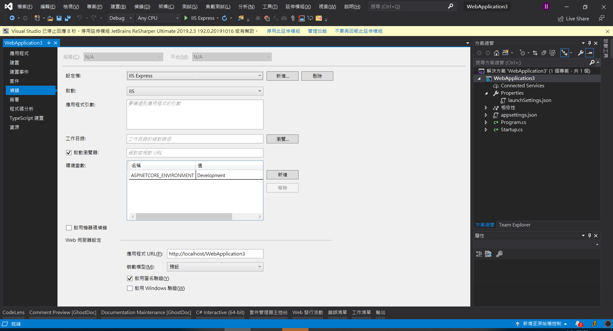

# 開發相關

-  -  -  -  -

# launchSettings.json（一）

- 在開發環境中啟用生產環境不應該公開的功能。 例如，ASP.NET Core 範本會在開發環境中啟用開發人員例外狀況頁面。

- 一般開發中我們可以在專案的 Properties\launchSettings.json 檔案設定適用於本機電腦開發的環境。 在 launchSettings.json 中設定的環境值會覆寫系統環境的設定值。

- launchSettings.json 配置文件使我們可以在不同的設置下執行我們的應用程序。

-  -  -  -  -

# launchSettings.json（二）

```json
{
  "iisSettings": {
    "windowsAuthentication": false, 
    "anonymousAuthentication": true, 
    "iisExpress": {
      "applicationUrl": "http://localhost:2088",
      "sslPort": 44318
    }
  },
  "profiles": {
    "IIS Express": {
      "commandName": "IISExpress",
      "launchBrowser": true,
      "environmentVariables": {
        "ASPNETCORE_ENVIRONMENT": "Development"
      }
    },
    "aspnetcoremvc": {
      "commandName": "Project",
      "launchBrowser": true,
      "applicationUrl": "https://localhost:5002;http://localhost:5003",
      "environmentVariables": {
        "ASPNETCORE_ENVIRONMENT": "Development"
      }
    }
  }
}
```

-  -  -  -  -

# launchSettings.json（三）

- 在visual studio 除了已可以直接修改 launchSettings.json 外，也可以透過專案屬性頁中的偵錯頁籤以GUI進行修改。




-  -  -  -  -

# launchSettings.json（四）

- 在 launchSettings.json 一開始分為兩個區塊：
  1.  `iisSettings` ： 用於設置IIS相關的選項。
  2.  `profiles` ： 節點定義了一系列用於表示應用啟動場景的Profile。

-  -  -  -  -

# launchSettings.json（四）

- commandName：啟動當前應用程序的命令類型，有效的選項包括IIS、IISExpress、Executable和Project，前三個選項分別表示採用IIS、IISExpress和指定的可執行文件（.exe）來啟動應用程序。如果我們使用dotnet run命令來啟動程序，對應Profile的啟動命名名稱應該設置為Project。
- executablePath：如果commandName屬性被設置為Executable，我們需要利用該屬性來設置啟動可執行文件的路徑（絕對路徑或者相對路徑）。
- environmentVariables：該屬性用來設置環境變量。

-  -  -  -  -

# launchSettings.json（五）

- commandLineArgs：命令行參數，即傳入Main方法的參數列表。
- workingDirectory：啟動當前應用運行的工作目錄。
- applicationUrl：應用程式採用的URL列表，多個URL之間採用分號（`；`）進行分隔。
- launchBrowser：一個布林類型的開關，表示應用程序的時候是否自動啟動瀏覽器。
- launchUrl：如果launchBrowser被設置為true，瀏覽器採用的初始化路徑通過該屬性進行設置。

-  -  -  -  -

# launchSettings.json（六）

- 以 dotnet run 啟動應用程式時，會使用具有 "commandName": "Project" 的第一個設定檔。 
- commandName 的值可指定要啟動的網頁伺服器。 commandName 可以是下列任何一個項目：
  - IISExpress
  - IIS
  - Project (這會啟動 Kestrel)

-  -  -  -  -

# launchSettings.json（七）

- launchSettings.json 僅在開發環境上使用，如果我們將寫好的網站發佈出去，則不會包含這個檔案。

-  -  -  -  -

# launchSettings.json（八）

- 試著在 launchSettings 的 profiles 增加一個 test 的設定，並利用指令 `dotnet run --launch-profile test` 將它啟動：

```json
{
  "iisSettings": {
    "windowsAuthentication": false, 
    "anonymousAuthentication": true, 
    "iisExpress": {
      "applicationUrl": "http://localhost:2088",
      "sslPort": 44318
    }
  },
  "profiles": {
    "IIS Express": {
      "commandName": "IISExpress",
      "launchBrowser": true,
      "environmentVariables": {
        "ASPNETCORE_ENVIRONMENT": "Development"
      }
    },
    "aspnetcoremvc": {
      "commandName": "Project",
      "launchBrowser": true,
      "applicationUrl": "https://localhost:5002;http://localhost:5003",
      "environmentVariables": {
        "ASPNETCORE_ENVIRONMENT": "Development"
      }
    },
    "test": {
      "commandName": "Project",
      "launchBrowser": true,
      "applicationUrl": "https://localhost:5004;http://localhost:5005",
      "environmentVariables": {
        "ASPNETCORE_ENVIRONMENT": "Development"
      }
    }
  }
}
```

-  -  -  -  -

# 一次註冊Service和Repository（一）

- 使用AutoFac時，我們可以用下面這段程式碼一次註冊專案中的Service和Repository。

```csharp
builder.RegisterAssemblyTypes(Assembly.Load("DAL"))
    .Where(t => t.Name.EndsWith("Repository"))
    .AsImplementedInterfaces()
    .InstancePerLifetimeScope();
```

-  -  -  -  -

# 一次註冊Service和Repository（二）

- ASP.NET Core中，我們也可以改為使用 AutoFac 或其他 DI Container，或是用下面的方式一次註冊：

```csharp
public static void ResolveAllTypes(this IServiceCollection services, string solutionPrefix, params string[] projectSuffixes)
        {
            var allAssemblies = new List<Assembly>();
            var path = Path.GetDirectoryName(Assembly.GetExecutingAssembly().Location);

            foreach (var dll in Directory.GetFiles(path, "*.dll"))
                allAssemblies.Add(Assembly.LoadFile(dll));


            var types = new List<Type>();
            foreach (var assembly in allAssemblies)
            {
                if (assembly.FullName.StartsWith(solutionPrefix))
                {
                    foreach (var assemblyDefinedType in assembly.DefinedTypes)
                    {
                        if (projectSuffixes.Any(x => assemblyDefinedType.Name.EndsWith(x)))
                        {
                            types.Add(assemblyDefinedType.AsType());

                        }
                    }
                }
            }

            var implementTypes = types.Where(x => x.IsClass).ToList();
            foreach (var implementType in implementTypes)
            {
                var interfaceType = implementType.GetInterface("I" + implementType.Name);

                if (interfaceType != null)
                {
                    services.Add(new ServiceDescriptor(interfaceType, implementType,
                        ServiceLifetime.Scoped));
                }

            }

        }
```
