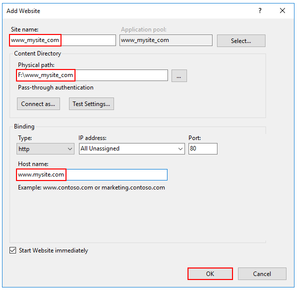
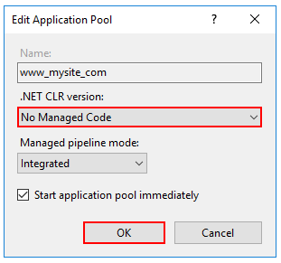

# 發佈

-  -  -  -  -

# IIS部署（一）

1. 安裝 .NET Core 裝載套件組合(https://www.microsoft.com/net/permalink/dotnetcore-current-windows-runtime-bundle-installer)
> 在 IIS 伺服器上安裝 .NET Core 裝載套件組合。 套件組合會安裝 .NET Core 執行階段、.NET Core 程式庫和 ASP.NET Core 模組。 此模組可讓 ASP.NET Core 應用程式在 IIS 背後執行。

-  -  -  -  -

# IIS部署（二）

2. 使用 dotnet publish，將應用程式發佈到資料夾。
```command
dotnet publish --configuration Release
```

-  -  -  -  -

# IIS部署（三）

3. 在 [IIS 管理員] 中，於 [連線] 面板中開啟伺服器的節點。 以滑鼠右鍵按一下 [網站] 資料夾。 從操作功能表選取 [新增網站]。
4. 提供網站名稱，並將實體路徑設定為應用程式的部署資料夾。 透過選取 [確定] 來提供繫結設定並建立網站。

-  -  -  -  -

# IIS部署（四）



-  -  -  -  -

# IIS部署（五）

5. 在伺服器的節點之下，選取 [應用程式集區]。
6. 以滑鼠右鍵按一下網站的應用程式集區，然後從操作功能表選取 [基本設定]。
7. 在 [編輯應用程式集區] 視窗中，將 [.NET CLR 版本] 設定為 [沒有受控碼]。

-  -  -  -  -

# IIS部署（六）



-  -  -  -  -

# IIS部署（七）

- ASP.NET Core 會在不同的處理序中執行，並管理執行階段。 ASP.NET Core 不仰賴載入桌面 CLR (.NET CLR)—會使用 .NET Core 的核心通用語言執行平台 (CoreCLR) 來開機以在背景工作處理序中裝載應用程式。 
- 將 [.NET CLR 版本] 設定為 [沒有受控碼] 是選擇性的，但建議這樣做。

-  -  -  -  -

# Docker（一）

- Docker 是開放原始碼專案，將應用程式自動化部署為可攜式且可自足的容器，在雲端或內部部署上執行。 Docker 也是一家升級及發展這項技術的公司，並且與雲端、Linux 和 Windows 廠商 (包括 Microsoft) 合作。

- Docker 和 傳統VM方式 的不同之處在於容器是在作業系統層面上實作虛擬化，直接使用本地主機的作業系統，而傳統方式則是在硬體層面實作。

-  -  -  -  -

# Docker（二）


-  -  -  -  -

# 為什麼要使用 Docker？（一）

- Docker 容器的啟動可以在秒級實作，這相比傳統的虛擬機方式要快得多。 
- Docker 對系統資源的使用率很高，一台主機上可以同時執行數千個 Docker 容器。

-  -  -  -  -

# 為什麼要使用 Docker？（二）

- 更快速的交付和部署
- 更有效率的虛擬化
- 更輕鬆的遷移和擴展
- 更簡單的管理

-  -  -  -  -

# 為什麼要使用 Docker？（三）

<escape>
    <table>
<thead>
<tr>
<th>特性</th>
<th>容器</th>
<th>虛擬機</th>
</tr>
</thead>
<tbody>
<tr>
<td>啟動</td>
<td>秒級</td>
<td>分鐘級</td>
</tr>
<tr>
<td>硬碟容量</td>
<td>一般為 MB</td>
<td>一般為 GB</td>
</tr>
<tr>
<td>效能</td>
<td>接近原生</td>
<td>比較慢</td>
</tr>
<tr>
<td>系統支援量</td>
<td>單機支援上千個容器</td>
<td>一般幾十個</td>
</tr>
</tbody>
</table><!-- .element style="font-size: 0.6em;" -->
</escape>

-  -  -  -  -

# Docker-Image

- 包含建立容器所需之所有相依性和資訊的封裝。 映像會包含所有相依性 (例如架構)，以及容器執行階段所要使用的部署和執行組態。 通常，一個映像會衍生自多個基底映像，這些基底映像是彼此交互堆疊以構成容器檔案系統的圖層。 映像一旦建立，就不可改變。

-  -  -  -  -

# Docker-Container

- Docker 映像的執行個體。 
- 容器代表單一應用程式、處理序或服務的執行。 其中包含 Docker 映像的內容、執行環境和一組標準的指示。
-  擴充服務時，您會從同一個映像建立容器的多個執行個體。 或者，一個批次工作可以從同一個映像建立多個容器，並將不同的參數傳遞至每個執行個體。

-  -  -  -  -

# Docker-Repository
- 相關的 Docker 映像集合，已加上標記指出映像版本。 
- 某些存儲庫包含特定圖像的多個變體，例如包含 SDK（較重的）的圖像、僅包含運行時（較輕）的圖像等。這些變體可以使用標記進行標記。 一個存放庫可以包含多種平台變化，例如 Linux 映像和 Windows 映像。

-  -  -  -  -

# Docker-dockerfile

- 包含有關如何構建 Docker 映射的說明的文字檔。 如同批次指令碼，第一行說明開始的基底映像，然後遵循指示安裝必要的程式、複製檔案等，直到取得您需要的工作環境。

-  -  -  -  -

# 簡單Docker實作（一）

1. 建立一個新的MVC專案，命名為helloworld。

2. 在專案根目錄下建立一個文件，檔名為Dockerfile（無副檔名）。

```
# 1. 指定編譯和發佈應用的鏡像
FROM mcr.microsoft.com/dotnet/core/sdk:3.0 AS build

# 2. 指定（編譯和發佈）工作目錄
WORKDIR /app

# 3. 拷貝.csproj到工作目錄/app，然後執行dotnet restore恢復所有安裝的NuGet包
COPY *.csproj ./
RUN dotnet restore

# 4. 拷貝所有文件到工作目錄(/app)，然後執行dotnet publish命令將應用發佈到/app/out目錄下
COPY . ./
RUN dotnet publish -c Release -o out

# 5. 編譯生成Docker鏡像
# 5.1.設置基礎鏡像
FROM mcr.microsoft.com/dotnet/core/aspnet:3.0 AS runtime

# 5.2. 設置（運行）工作目錄，並將發佈文件拷貝到out子目錄下
WORKDIR /app
COPY --from=build /app/out .

# 5.3. 利用環境變量設置ASP.NET Core應用的監聽地址
ENV ASPNETCORE_URLS http://0.0.0.0:3721

# 5.4. 執行dotnet命令啟動ASP.NET Core應用
ENTRYPOINT ["dotnet", "helloworld.dll"]
```

-  -  -  -  -

# 簡單Docker實作（二）

- Dockerfile文件定義好之後，我們打開CMD命令行並切換到項目所在根目錄（也就是Dockerfile文件所在的目錄），然後執行`docker build -t helloworldapp .`命令，該命令會利用這個Dockerfile文件生成一個命名為helloworldapp的Docker鏡像。

-  -  -  -  -

# 簡單Docker實作（三）

- 我們執行`docker run -d -p 8080:3721 --name myapp helloworldapp`命令針對前面生成的Docker鏡像（helloworldapp）創建並啟動了一個命名為myapp（--name myapp）的容器。
- 由於我們從外面訪問這個應用，所以我們通過端口映射（-p 8080:3721）將內部監聽端口3721映射為當前宿主機器的端口8080，所以我們利用地址`http://localhost:8080`訪問這個通過Docker容器承載的ASP.NET Core應用。 
